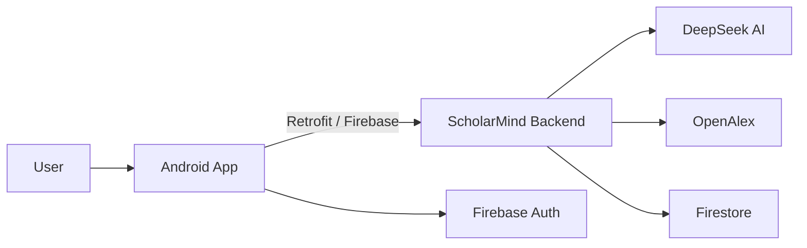

# ScholarMind

<div align="center">
  
</div>

<div align="center">


</div>

<p align="center">
  <a href="#overview">Overview</a> |
  <a href="#architecture">Architecture</a> |
  <a href="#android-app">Android App</a> |
  <a href="#backend-api">Backend API</a> |
  <a href="#backend-deployment">Backend Deployment</a> |
  <a href="#setup">Setup</a> |
  <a href="#api-reference">API Reference</a> |
  <a href="#troubleshooting">Troubleshooting</a>
</p>

---

## Overview

ScholarMind is an AI-powered research companion made of two parts:

1. An Android app for uploading papers, searching literature, reading in multiple modes, and managing study workflows.
2. A FastAPI backend in `FastAPI_Backend/` that extracts paper text, calls AI models, queries OpenAlex, and returns structured research features to the app.

The goal is simple: help users move from a raw paper to understanding, notes, references, and review with as little friction as possible.

## Architecture



### What happens in the flow

1. The user signs in and uploads a PDF.
2. The app sends the document to the backend.
3. The backend extracts text, repairs AI JSON when needed, and returns structured results.
4. The app presents paper summaries, chat modes, quiz cards, podcast playback, citations, peer review, and reference tools.
5. Search and trending paper screens use OpenAlex for live literature discovery.

## Android App

The Android client is a multi-screen research workspace with a polished, animated UI.

| Area | What it does |
| --- | --- |
| Authentication | Google sign-in, email/password login, sign-up, password reset |
| Upload flow | Pick PDFs, show animated upload progress, analyze up to 5 files per session |
| Reading modes | Beginner mode, technical mode, freeform chat, summary mode, simplifier |
| Study tools | Flashcards, quiz generation, podcast-style explanation, citations viewer |
| Research tools | Search papers, trending papers, paper details, paper insights |
| Review tools | Peer review assistant, reference generation, DOCX/PDF export |
| Personalization | Home feed, reading history, profile stats, saved paper state |

### Key screens and flows

<details>
<summary><strong>Open the main app flow</strong></summary>

| Screen | Purpose |
| --- | --- |
| Splash | App entry point and theme bootstrap |
| Main | Sign in / Google sign-in |
| Sign Up | Create account and initialize profile |
| Home | Recent paper view, mode shortcuts, profile access |
| Upload | Select PDF, validate size, upload to backend |
| Processing | Analyze uploaded file and move into study actions |
| Mode Select | Choose Beginner, Technical, or Podcast mode |
| Beginner Mode | Friendly explanation of the paper |
| Technical Mode | Sectioned, detailed research breakdown |
| Chat Mode | Ask questions about a paper in natural language |
| Summary | Concise paper summary and overview |
| Simplifier | Rewrites text for easier understanding |
| Citations | View formatted citations and download options |
| Quiz Mode | Generate multiple-choice comprehension questions |
| Podcast Flow | Setup, progress, and player screens |
| Dashboard | Hub for paper tools and research actions |
| Add References | Generate references from uploaded paper text |
| Peer Review | Request critique, limitations, and reviewer questions |
| Search Papers | Search OpenAlex and browse trending papers |
| Paper Details | Inspect a paper's metadata and citations |

</details>

### App highlights

- Animated upload dialog and progress indicators
- Staggered card entrance animations on the dashboard
- Scale feedback for tap interactions
- Firebase-backed user identity and paper state
- Research history and saved paper tracking
- Multiple reading modes for different learning styles
- Integrated paper discovery through OpenAlex

## Backend API

The backend lives in `FastAPI_Backend/` and is built with FastAPI.

| Feature | Description |
| --- | --- |
| PDF extraction | Reads uploaded PDFs with `pdfplumber` |
| DOCX extraction | Reads Word documents without relying on Word-specific desktop tools |
| AI analysis | Produces structured paper metadata and section content |
| JSON repair | Repairs malformed AI output before parsing |
| Firestore fallback | Loads stored paper context when needed |
| Chat modes | Beginner, technical, and freeform research chat |
| Flashcards | Generates study cards from paper context |
| Podcast script | Generates a two-host explanatory script |
| Summary | Returns a concise paper summary |
| Simplify text | Rewrites dense academic text for easier reading |
| Quiz generation | Creates multiple-choice comprehension questions |
| OpenAlex search | Searches papers, trending papers, and paper details |
| Paper insights | Returns summary, findings, applications, and limitations |
| Peer review | Generates limitations, technical flaws, and reviewer questions |
| References | Generates reference lists and exports DOCX/PDF files |
| CORS support | Allows the Android app to talk to the API from anywhere |

## Backend Deployment

The FastAPI backend has been deployed on Vercel.

| Link | URL |
| --- | --- |
| Production API | `https://your-vercel-deployment-url.vercel.app` |
| API docs | `https://your-vercel-deployment-url.vercel.app/docs` |
| Health check | `https://your-vercel-deployment-url.vercel.app/` |

Replace the placeholder URL with your actual Vercel production URL.

Expected health check response:

```json
{
  "message": "Welcome to Scholar Mind AI Backend"
}
```

The full backend deployment guide is available in [FastAPI_Backend/README.md](FastAPI_Backend/README.md).

## Repository Structure

```text
ScholarGit/
|-- App_Code/
|   `-- app/
|       |-- build.gradle.kts
|       |-- google-services.json
|       `-- src/
`-- FastAPI_Backend/
    |-- main.py
    |-- ai.py
    |-- models.py
    |-- pdf.py
    |-- requirements.txt
    |-- vercel.json
    |-- test_endpoints.py
    `-- README.md
```

## Setup

### 1) Backend setup

```bash
cd FastAPI_Backend
python -m venv .venv
.venv\Scripts\activate
pip install -r requirements.txt
```

Create a `.env` file in `FastAPI_Backend/`:

```env
DEEPSEEK_API_KEY=your_deepseek_api_key_here
OPENALEX_API_KEY=optional_openalex_key
```

Run the server:

```bash
uvicorn main:app --reload --host 0.0.0.0 --port 8000
```

Open the interactive docs:

```text
http://127.0.0.1:8000/docs
```

### 2) Android app setup

Open the Android project in Android Studio, then:

1. Sync Gradle.
2. Make sure `google-services.json` is present.
3. Confirm the backend base URL is correct in `build.gradle.kts` or `NetworkConfig.java`.
4. Run on an emulator or real device.

### 3) Base URL notes

| Scenario | Recommended backend URL |
| --- | --- |
| Android emulator + local backend | `http://10.0.2.2:8000/` |
| Real device on same Wi-Fi | `http://<your-pc-ip>:8000/` |
| Public access / testing | `https://<your-ngrok-url>/` |
| Production app | `https://your-vercel-deployment-url.vercel.app/` |

If you are using the current debug configuration, remember that the app is pointed at an ngrok URL in the Gradle config, so update it before shipping a release build.

### 4) Vercel deployment

The backend is configured for Vercel with [vercel.json](FastAPI_Backend/vercel.json).

```bash
cd FastAPI_Backend
vercel
vercel --prod
```

Set `DEEPSEEK_API_KEY` and optional `OPENALEX_API_KEY` in the Vercel project settings, then redeploy after any environment variable update.

## Environment

### Android app dependencies

- AndroidX, Material, ConstraintLayout
- Firebase Auth and Firestore
- Retrofit and OkHttp
- Navigation Fragment

### Backend dependencies

- FastAPI
- Uvicorn
- python-dotenv
- OpenAI client for DeepSeek
- pdfplumber
- python-docx
- reportlab

## API Reference

<details>
<summary><strong>Open the endpoint list</strong></summary>

| Method | Endpoint | Purpose |
| --- | --- | --- |
| GET | `/` | Health / welcome message |
| POST | `/api/pdf/extract` | Extract text from a PDF and cache it |
| POST | `/api/pdf/analyze` | Analyze a PDF and return structured paper data |
| GET | `/api/pdf/analysis/{doc_id}` | Fetch a previously generated analysis |
| POST | `/api/chat/beginner` | Beginner-friendly paper chat |
| POST | `/api/chat/technical` | Technical paper chat |
| POST | `/api/chat/freeform` | Freeform paper chat |
| POST | `/api/flashcards/generate` | Create flashcards from the paper context |
| POST | `/api/podcast/generate` | Generate a podcast-style script |
| POST | `/api/summary/generate` | Generate a short paper summary |
| POST | `/api/text/simplify` | Simplify raw text |
| POST | `/api/quiz/generate` | Generate quiz questions |
| GET | `/api/papers/search` | Search OpenAlex papers |
| GET | `/api/papers/trending` | Fetch trending papers |
| GET | `/api/papers/{paper_id}` | Retrieve detailed paper metadata |
| POST | `/api/papers/insights` | Build abstract-based insights |
| POST | `/api/peer-review/analyze` | Produce peer-review style critique |
| POST | `/api/references/generate` | Generate references from a paper |
| POST | `/api/references/export/docx` | Export references to DOCX |
| POST | `/api/references/export/pdf` | Export references to PDF |

</details>

## Feature Breakdown

<details>
<summary><strong>Android app feature details</strong></summary>

| Feature | Notes |
| --- | --- |
| Upload and analyze | Upload PDFs, analyze them, and move into the study pipeline |
| Home dashboard | Resume recent papers and jump into the correct mode |
| Beginner mode | Simple explanations for non-experts |
| Technical mode | Sectioned, deep-dive academic breakdowns |
| Chat mode | Ask follow-up questions about the selected paper |
| Summary mode | Read the paper in a compact overview format |
| Simplifier | Rephrase dense technical text into easier language |
| Citations | View extracted citations and reference data |
| Quiz mode | Reinforce reading with multiple-choice checks |
| Podcast mode | Turn the paper into an audio-style script and player flow |
| Search papers | Browse OpenAlex results and trending papers |
| Peer review | Generate constructive criticism and reviewer questions |
| References | Generate and export formatted citations |

</details>

<details>
<summary><strong>Backend feature details</strong></summary>

| Feature | Notes |
| --- | --- |
| JSON repair | Handles malformed AI output before parsing it into models |
| Fallback analysis | Produces a usable response when full AI parsing fails |
| Firestore recovery | Rebuilds cached paper context from Firestore when needed |
| OpenAlex parsing | Normalizes authors, venue, abstract, topics, and metadata |
| Reference export | Produces downloadable DOCX and PDF files |
| Paper insights | Summarizes title and abstract into practical research notes |
| Peer review | Returns limitations, flaws, and reviewer questions |

</details>

## How To Run

### Backend

1. Navigate to `FastAPI_Backend/`.
2. Create and activate a virtual environment.
3. Install dependencies from `requirements.txt`.
4. Add your `DEEPSEEK_API_KEY` in `.env`.
5. Start FastAPI with `uvicorn main:app --reload --host 0.0.0.0 --port 8000`.
6. Visit `http://127.0.0.1:8000/docs` to test the API.

### Android app

1. Open the Android project in Android Studio.
2. Sync Gradle and wait for dependencies to finish.
3. Confirm `google-services.json` is present.
4. Update the backend base URL if you are not using the current ngrok address or your Vercel production URL.
5. Run the app on an emulator or physical device.

### Suggested launch order

1. Start the backend first.
2. Verify the API in Swagger docs.
3. Launch the Android app.
4. Upload a paper and confirm analysis, chat, and summary flows work.

## Troubleshooting

- If the app cannot reach the backend, check the base URL in the Android config and make sure your server is listening on the right host and port.
- If PDF analysis fails, confirm the file is a valid PDF and under the app's size limit.
- If DeepSeek responses fail, verify `DEEPSEEK_API_KEY` in the backend `.env` or Vercel settings.
- If paper search fails, confirm outbound internet access and optional OpenAlex credentials.
- If Firebase screens fail to load, check `google-services.json` and your Firestore rules.
- If the backend returns malformed JSON, the repair layer should handle most cases automatically; if not, inspect the AI prompt and response in `FastAPI_Backend/ai.py`.

## Notes

- The backend enables permissive CORS so the Android client can reach it during development.
- The app uses Firestore-backed persistence for paper history, chats, and selected paper state.
- Some flows are animation-heavy on purpose to make the app feel responsive and polished.
- Vercel deployments are serverless, so backend in-memory context is temporary by design.
